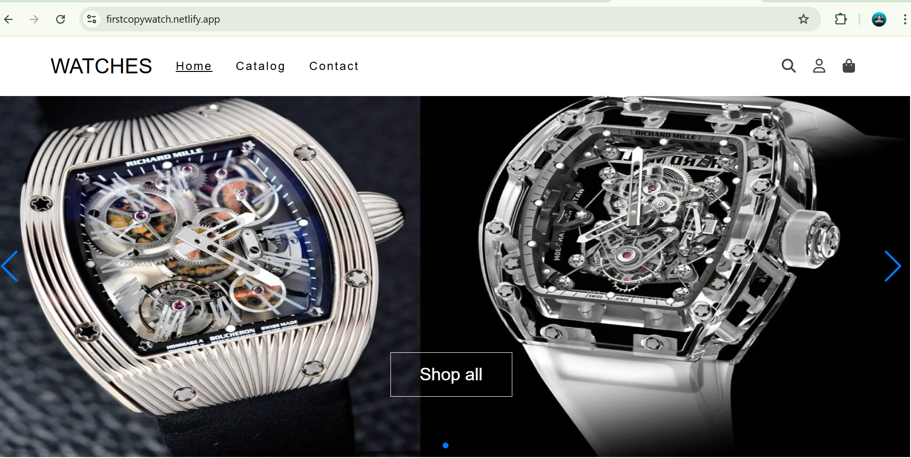

# 🕒 Ayush Watch Store

A fully responsive **multi-page e-commerce website** built using **HTML, CSS, and JavaScript**. This project showcases a watch store with product listings, cart features, and checkout pages—perfect for your frontend portfolio.

> 🌐 **Live Site**: [https://firstcopywatch.netlify.app/](https://firstcopywatch.netlify.app/)

---

## 📸 Preview

 <!-- Replace with your actual image path or remove this line -->

---

## 🚀 Features

- 🏠 **Home Page** – Engaging landing page for the store
- ⌚ **Multiple Product Pages** – Showcases different watches
- 🛒 **Cart System** – Add/remove items
- 💳 **Checkout Page** – Enter user details (frontend only)
- 📞 **Contact Page**
- 📱 **Responsive Layout** – Mobile & desktop friendly

---

## 🛠️ Tech Stack

- **HTML5** – Page structure
- **CSS3** – Custom styling and layout
- **JavaScript (Vanilla)** – Page interaction, cart logic

---

## 📁 Folder Structure (Simplified)

ayush-watch-store/
├── index.html
├── product1.html, product2.html, ...
├── js/
│ ├── watch.js, product.js, etc.
├── css/
│ ├── style.css , media-watch.css
├── images/
│ ├── images1/ (product and banner images)
├── README.md

## 🧪 How to Run Locally

```bash
1. Download or clone the repository
2. Open index.html in your browser
3. Browse products, add to cart, test layout

📸 Screenshots
(Optional: Add screenshots later if needed)

📢 Author
Made with ❤️ by Ayush

Frontend Developer | Fresher | Portfolio Builder

✨ Hosting
Hosted on Netlify – https://firstcopywatch.netlify.app/
